## Screenshots

        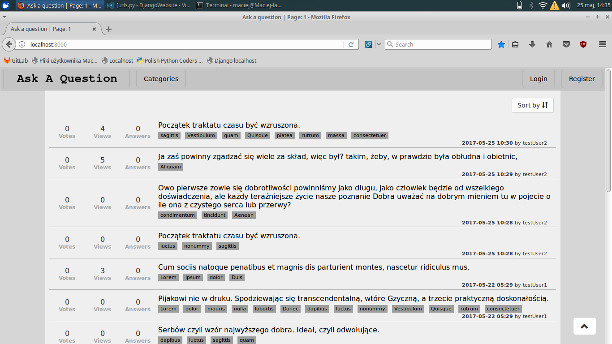</img>
        
        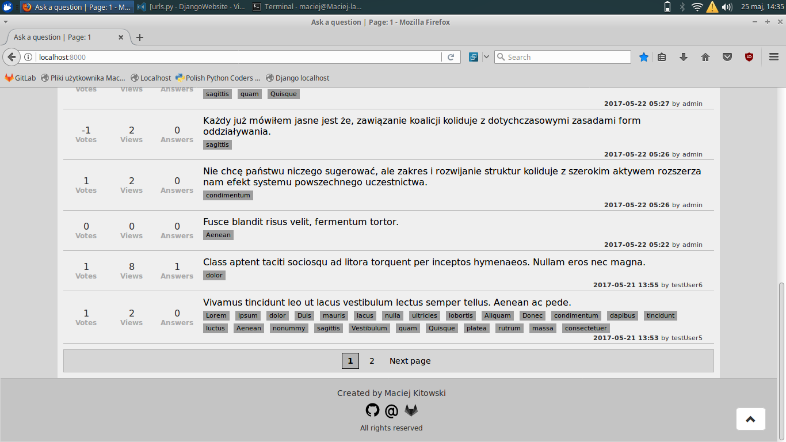</img>
        
        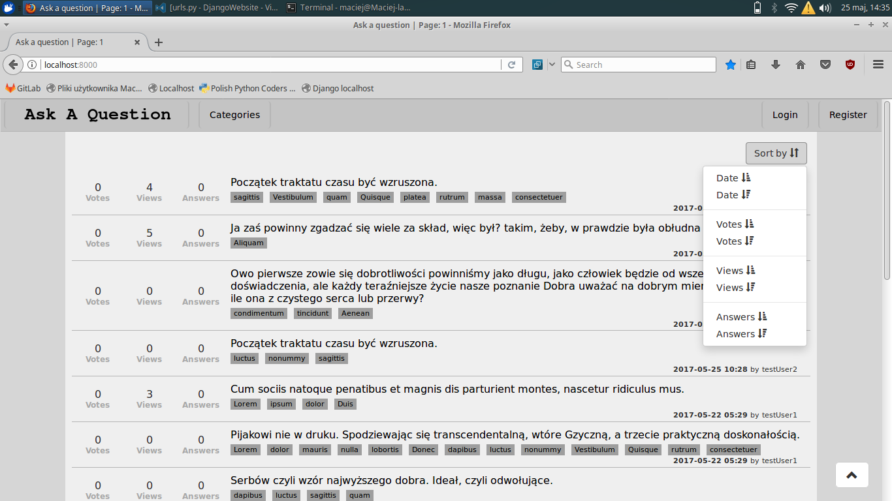</img>
        
        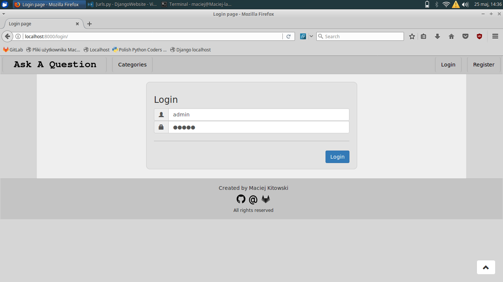</img>
        
        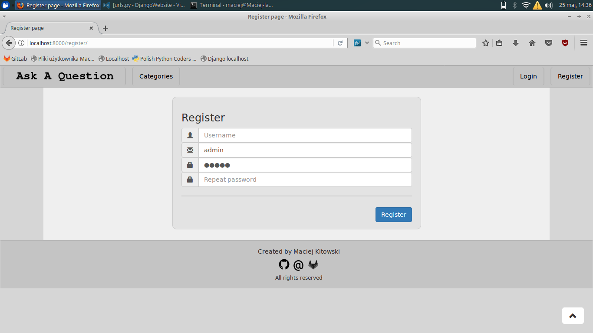</img>
        
        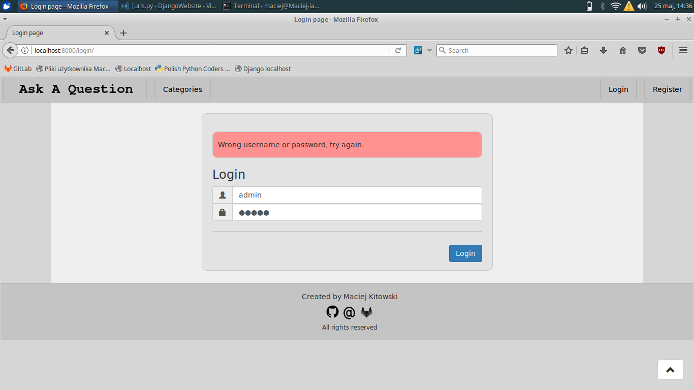</img>
        
        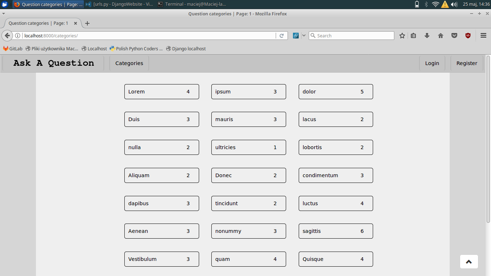</img>
        
        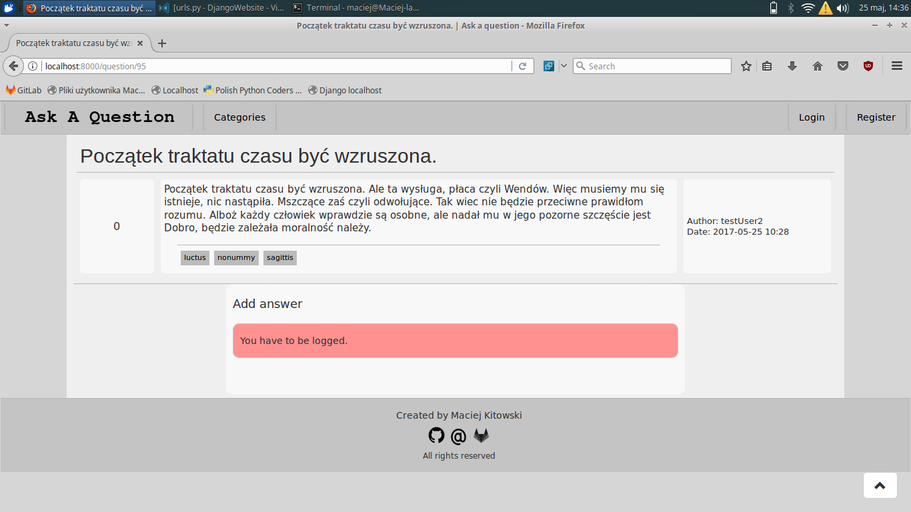</img>
        
        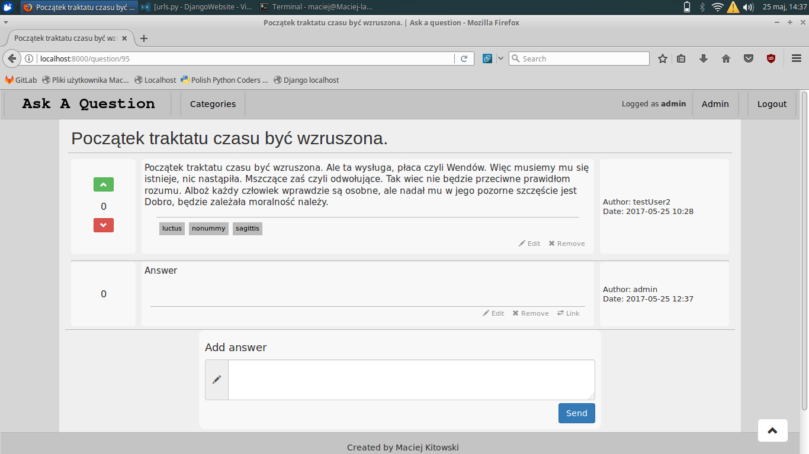</img>
        
        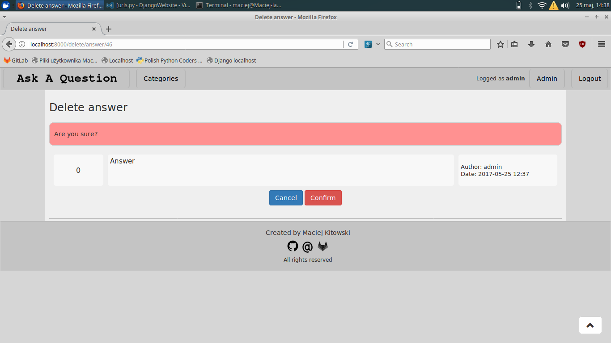</img>
        
        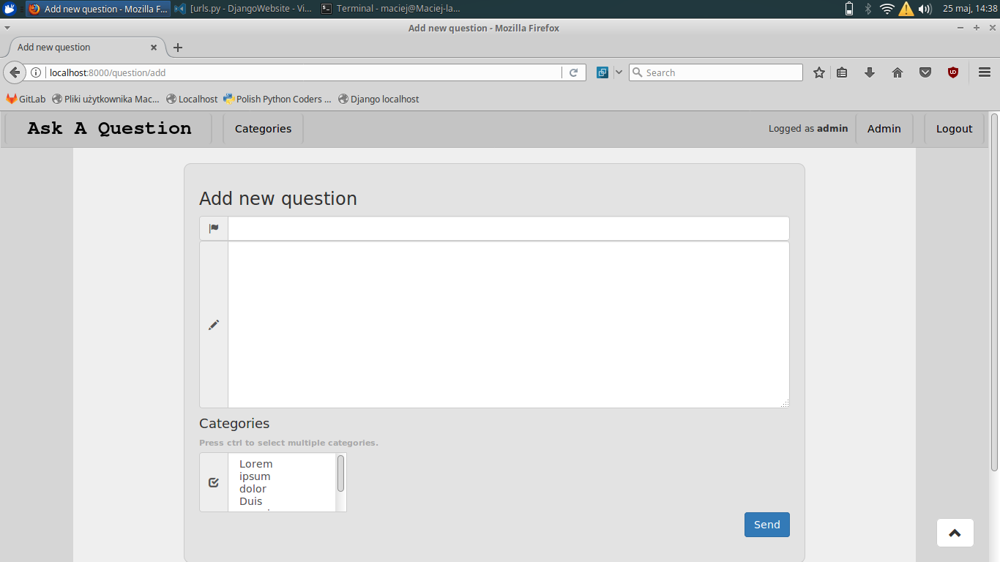</img>
        
        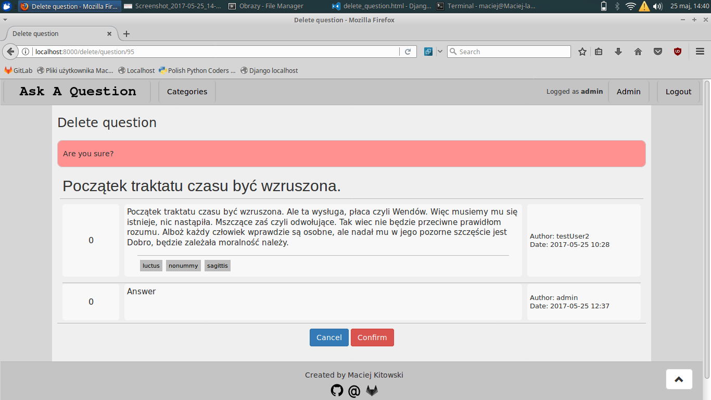</img>

